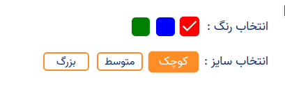

# Shop Price Checker

## Challenge

While it's too easy to support one or two filters at same time manualy.
The challenge of this task was to supporting N* of filters, while we dont know the number of filters before fetching the data from server. I mean state manager inside Reactjs when get data from API.

## More about the project

We are building a own ecommerce platform and what we faced in is to handling different filters of a product in React JS.

I have to explain more to you for make it sense.
For a single product page, maybe there are multi filters.
for examples:

1- Colors
2- Sizes
3- RAM
4- Disk space

and each of that filter has some options. for example: Colors has RED, BLUE, GREEN, etc.

## And so

I think this is still buggy and if you want to contribute or do your bets or a nice and cool JS challenge. it's for you.

Any kind of contribution are welcome.
